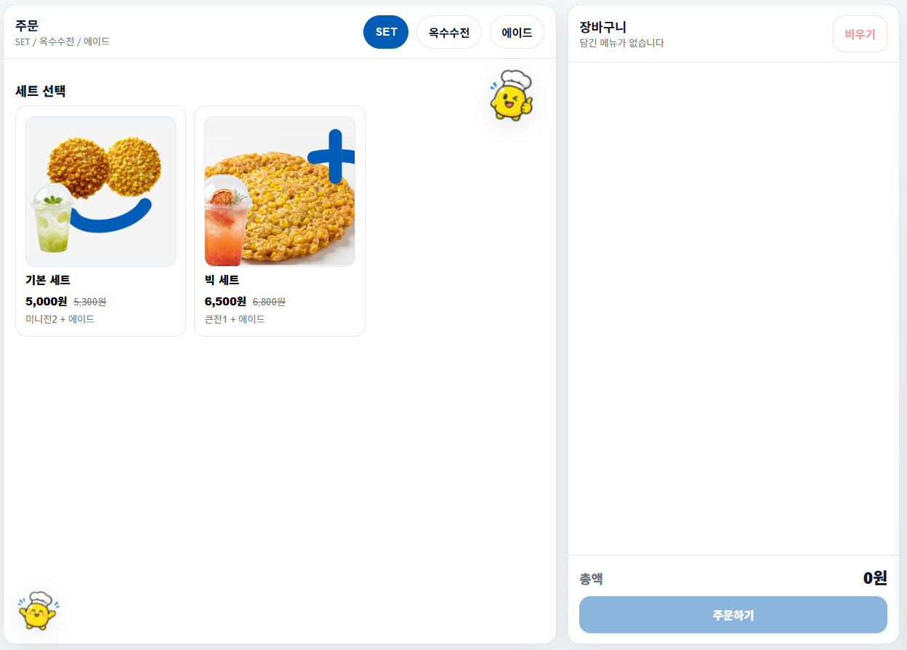
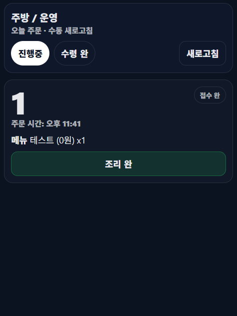

# Miileage

Miileage is a Spring Boot web application for a corn menu ordering and waiting-number flow. The app includes customer-facing menu pages, order APIs, waiting-ticket logic, and a cook dashboard for managing prepared and picked-up orders.

## Screenshots

Add screenshots to `docs/screenshots/` and replace the placeholder paths below.

### Home Page


> TODO: Add a screenshot of `/`.

### Customer Menu



> TODO: Add a screenshot of `/menu`.

### Waiting Number


> TODO: Add a screenshot after an order is paid and a waiting number is created.

### Cook Dashboard



> TODO: Add a screenshot of `/cook`.

## Tech Stack

### Frontend

- Thymeleaf templates
- HTML, CSS, and JavaScript
- Static image assets served by Spring Boot
- Main pages in `src/main/resources/templates`
- Static files in `src/main/resources/static`

### Backend

- Java 8
- Spring Boot 2.7.18
- Gradle
- Spring MVC
- Spring Data JPA
- MySQL
- Springdoc OpenAPI UI
- WAR packaging for Tomcat deployment

## Project Structure

```text
mileage/
|-- src/
|   |-- main/
|   |   |-- java/com/csee/hgu/menu/
|   |   |   |-- api/
|   |   |   |-- cook/
|   |   |   |-- order/
|   |   |   |-- waiting/
|   |   |   |-- HomeController.java
|   |   |   |-- HelloController.java
|   |   |   |-- MileageApplication.java
|   |   |   `-- ServletInitializer.java
|   |   `-- resources/
|   |       |-- static/
|   |       |-- templates/
|   |       `-- application.yml
|   `-- test/
|-- docs/
|   |-- MENU_DB.sql
|   `-- screenshots/
|-- build.gradle
|-- settings.gradle
|-- gradlew
|-- gradlew.bat
`-- README.md
```

## Features

- Customer menu and ordering flow
- Menu options for sizes, sets, toppings, and drinks
- Order creation and payment confirmation APIs
- Automatic waiting-number creation after payment
- Waiting-ticket confirmation with optional phone number
- Cook dashboard for confirmed, cooked, and picked-up tickets
- Revenue summary endpoint
- Database schema/reference SQL in `docs/MENU_DB.sql`

## Pages

| Route | Description |
| --- | --- |
| `/` | Home page |
| `/menu` | Customer menu and order page |
| `/cook` | Cook dashboard |

## API Endpoints

| Method | Endpoint | Description |
| --- | --- | --- |
| `GET` | `/hello` | Simple backend health/demo response |
| `POST` | `/api/orders` | Create a new order |
| `POST` | `/api/orders/{orderId}/paid` | Mark an order as paid and create a waiting ticket |
| `GET` | `/api/orders/{orderId}` | Fetch an order for testing/debugging |
| `GET` | `/api/waiting/current` | Get the current waiting number for today |
| `POST` | `/api/waiting/{ticketId}/confirm` | Confirm a waiting ticket and optionally save a phone number |
| `GET` | `/api/waiting/pending-count` | Count tickets that are not picked up |
| `GET` | `/api/cook/tickets?status=CONFIRMED` | List cook tickets by status |
| `POST` | `/api/cook/tickets/{ticketId}/cooked` | Mark a ticket as cooked |
| `POST` | `/api/cook/tickets/{ticketId}/picked-up` | Mark a ticket as picked up |
| `POST` | `/api/cook/tickets/{ticketId}/reopen` | Move a ticket back to confirmed |
| `GET` | `/api/cook/revenue` | Get today and total revenue |

## Prerequisites

- Java 8
- MySQL access
- Windows PowerShell, Command Prompt, Git Bash, or another shell that can run the Gradle wrapper

## Configuration

Application configuration is in:

```text
src/main/resources/application.yml
```

Update these values for your environment:

- `server.port`
- `spring.datasource.url`
- `spring.datasource.username`
- `spring.datasource.password`
- `spring.jpa.hibernate.ddl-auto`

Do not publish real production database credentials in a public repository. Use local environment-specific configuration for deployment secrets.

## Run Locally

From the project root:

```powershell
.\gradlew.bat bootRun
```

On macOS/Linux:

```bash
./gradlew bootRun
```

Open:

```text
http://localhost:8080/
http://localhost:8080/menu
http://localhost:8080/cook
```

## Build

Create a deployable WAR:

```powershell
.\gradlew.bat clean bootWar
```

On macOS/Linux:

```bash
./gradlew clean bootWar
```

The WAR is configured in `build.gradle` as:

```text
build/libs/naimkim_1.war
```

## Test

```powershell
.\gradlew.bat test
```

On macOS/Linux:

```bash
./gradlew test
```

## Tomcat Deployment

1. Build the WAR with `.\gradlew.bat clean bootWar`.
2. Upload `build/libs/naimkim_1.war` to the Tomcat `webapps/` directory.
3. Remove any old expanded `naimkim_1/` folder before redeploying.
4. Restart Tomcat or wait for auto-deploy.
5. Open the deployed context:

```text
https://your-server.example/naimkim_1/
https://your-server.example/naimkim_1/menu
https://your-server.example/naimkim_1/cook
```

## Notes

- Waiting-number business logic uses the `Asia/Seoul` time zone.
- JPA schema behavior is controlled by `spring.jpa.hibernate.ddl-auto`.
- If deployed pages do not update after replacing the WAR, clear the expanded Tomcat folder and hard refresh the browser.
